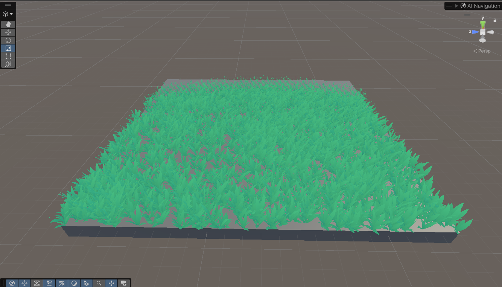
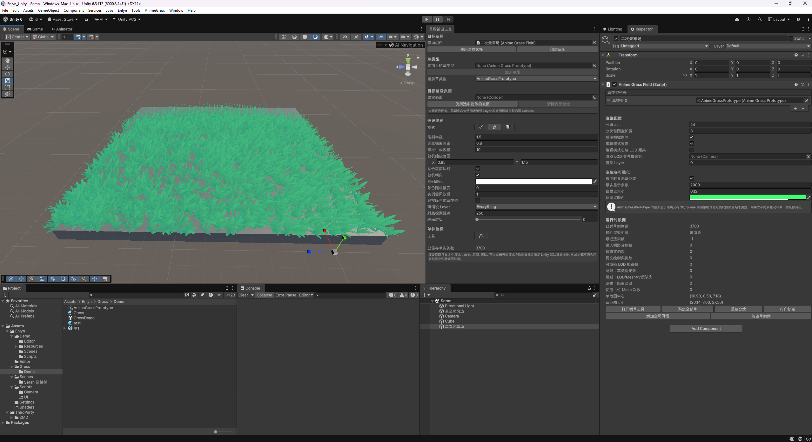

# AnimeGress

AnimeGress 是面向 Unity URP 的风格化草系统。它提供手工铺设、单株编辑、GPU Instancing、LOD 点状渐隐、全局风场、风场颜色变化、阴影和视锥剔除。

当前包版本为 `1.0.0`，Git 发布标签为 `v1.0`。

## 效果预览

## 系统组成

- `AnimeGrassField`：保存确定性的草实例数据，负责分块、LOD、视锥剔除和实例化绘制。
- `AnimeGrassPrototype`：定义草类型、模型校正、风权重和各级 LOD。
- `AnimeGrassRendererFeature`：在每个 URP 摄像机渲染阶段提交草绘制。
- `AnimeGrassWindZone`：设置全局风向、风力、阵风和风场颜色。
- `AnimeGrassPainterWindow`：提供普通鼠标、铺设、删除和单株编辑工作流。
- `AnimeGrassInstanced.shader`：提供风格化颜色、风动、点状渐隐和阴影处理。

## 环境要求

- Unity 6.0 或更高版本
- Universal Render Pipeline 17 或兼容版本
- 当前版本使用 URP Compatibility Mode 的 `ScriptableRenderPass.Execute`
- 草材质需要启用 GPU Instancing

## 安装

本项目已经以嵌入式包方式安装在 `Packages/com.ming.animegress`。

发布到远程 Git 仓库后，可以在 Package Manager 中使用 Git URL 安装，并在 URL 末尾指定 `#v1.0`。也可以选择 **Add package from disk**，然后选择本目录的 `package.json`。

## URP 配置

打开当前使用的 URP Renderer Data，在 Renderer Features 中添加 `AnimeGrassRendererFeature`。所有需要显示草的 Renderer Data 都应添加该 Feature。

当前 `v1.0` 使用 Compatibility Mode。请在 `Project Settings > Graphics > URP` 中启用 Compatibility Mode。后续版本可以增加 Render Graph 路径。

## 快速开始

1. 在 URP Renderer Data 的 Renderer Features 中添加 `AnimeGrassRendererFeature`。
2. 使用 `GameObject > AnimeGress > 二次元草场` 创建草场。
3. 使用 `Assets > Create > AnimeGress > 草类型配置` 创建草类型。
4. 为每个 LOD 指定 Mesh、Material、显示距离和渐隐距离。
5. 使用 `Window > AnimeGress > 草场铺设工具` 铺设、删除或编辑单株草。
6. 在场景中添加 `AnimeGrassWindZone`，控制全局风向、风力和风色。

`游戏 LOD 参考摄像机` 可以留空。留空时每个摄像机使用自身位置计算 LOD；指定后只影响游戏摄像机的 LOD 距离，不限制 Scene 视图或其他摄像机显示。

## LOD 配置

每级 LOD 包含：

- Mesh 与 Material
- Sub Mesh Index
- 开始距离和结束距离
- 点状渐隐距离
- 投射阴影与接收阴影开关

最后一级 LOD 的结束距离就是草的最大显示距离。`结束距离 = 0` 表示没有上限，不建议对大量实例使用。

## 铺设规则

铺设工具只在当前选中的 `AnimeGrassField` 上工作。目标表面被锁定后，射线只接受该 Collider，因此上层遮挡物不会抢占下层表面的铺设结果。

场景数据直接序列化在草场组件中，铺设结果是确定性的。单株编辑模式可以使用 Unity 默认移动、旋转和缩放工具修改实例。

## 模型规范

- 推荐模型根部位于局部坐标原点。
- 推荐局部 Y 轴向上、Z 轴向前。
- Blender 导出前应用 Rotation 和 Scale。
- 模型轴向或单位不一致时，在草类型配置中使用位置、旋转和缩放校正。
- 面片草与完整模型草都可以作为任意 LOD Mesh。

## 用户资源

草模型、材质、草类型配置和场景属于项目内容，不属于插件代码。它们可以放在任意 `Assets` 子目录。当前项目的演示内容保留在 `Assets/Enlyn/Gress/Demo`。

## API 兼容性

为保持已有项目兼容，公开类型继续使用 `Enlyn.Grass` 命名空间。包程序集名称为：

- `Ming.AnimeGress.Runtime`
- `Ming.AnimeGress.Editor`

